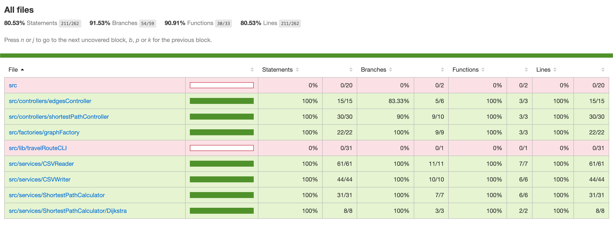
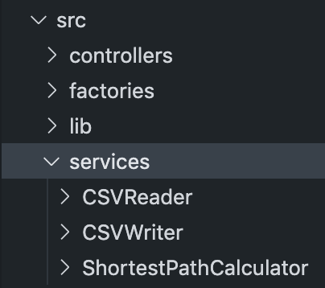
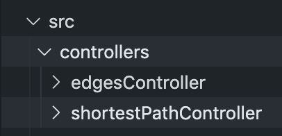
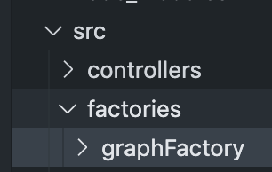
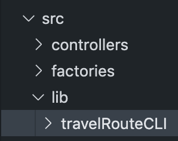
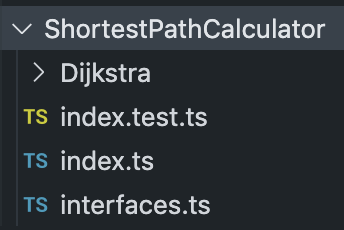
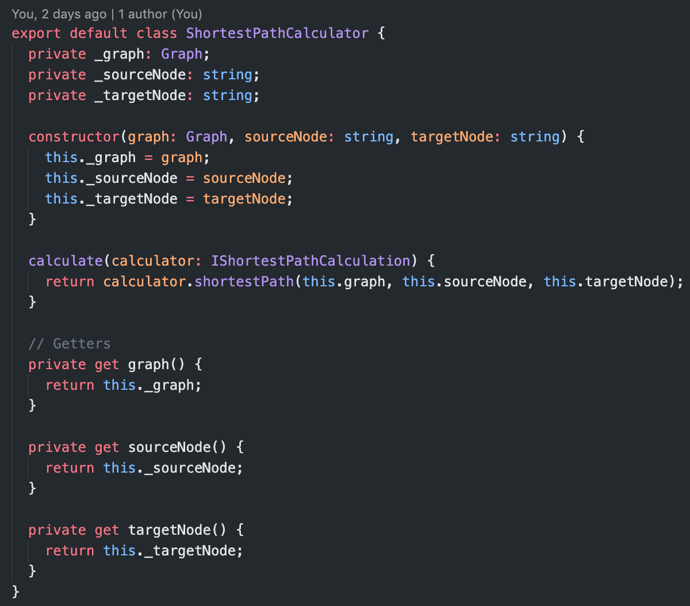
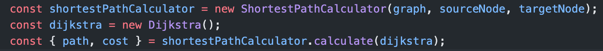
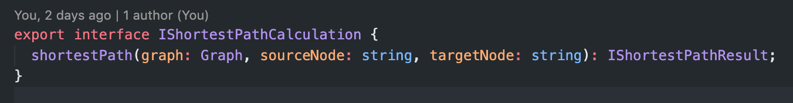
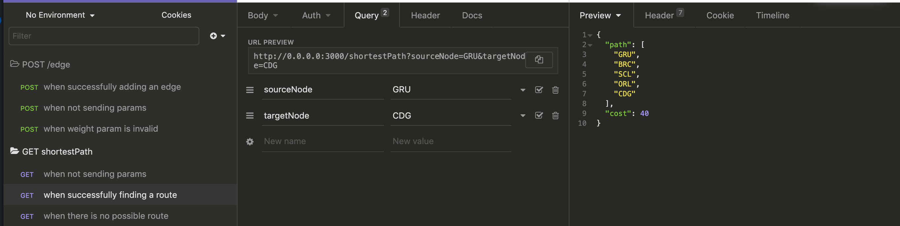

# Intro

For this project I worked on the SOLID principles and used some Design Patterns. The core functionality is 100% covered by tests.



# Folder Structure

## **src/services**


Here is the brain, the core functionality is written here in 3 classes: CSVWriter, CSVReader and the ShortestPathCalculator.

All these classes respect the Single Responsibility Principle. The ShortestPathCalculator was designed using the Open-Closed Principle, I'll explain it later.

## **src/controllers**


Where I store the edgesController (used in a POST request to add an edge to the csv) and the shortestPathController (used in a GET request to find the shortest path).

## **src/factories**


Here I'm storing the graphFactory, a function that reads the csv, builds a graph object and return it.

## **src/lib**


Here's the travelRouteCLI, where we can run it via terminal and see the shortest path from the graph.

# ShortestPathCalculator: Design Decisions




This class was designed to follow the Open-Closed Principle so if we need to add a different calculation algorithm (BellmanFord for example) we won't need to modify this class code, we can just extend it like in the code below. To achieve it I used the **Strategy Design Pattern**



We can see that if we need to change the calculus from Dijkstra to BellmanFord we only need to pass a BellmanFord class instance. The class only needs to implement the IShortestPathCalculation interface:




# How to run

First of all pull the project and install the dependencies

```
$ git pull https://github.com/emmanuelperotto/travel-route.git
```

```
$ cd travel-route
```

```
$ yarn install
```

## How To run the CLI

```
$ yarn run cli input-routes.csv
```


## How To run the REST API

Start the server so you can send requests using localhost

```
$ yarn start
```

The API provides two routes:

- GET /shortestPath: here you need to send "sourceNode" and "targetNode" via query params. The API returns 200 for success and 400/422 for failure.


- POST /edge: here you need to send "sourceNode", "targetNode" and "weight". The API returns 201 for success and 422 for failure.


